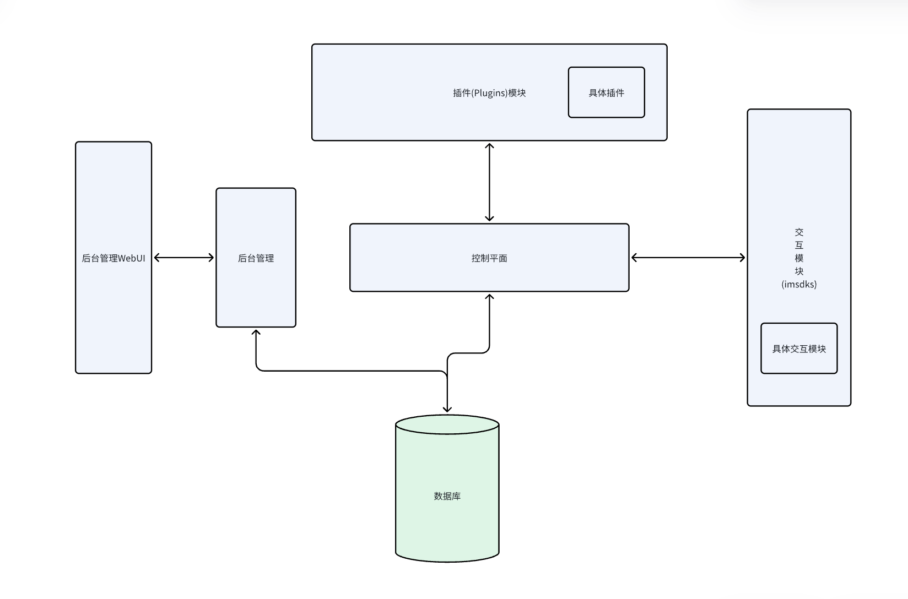

# AnywhereDoor
* 任意门：借助IM软件来实现内网服务打洞
* 项目架构：

## 模块地址:
* 项目地址: https://github.com/A0000000000/AnywhereDoor
* 控制平面: https://github.com/A0000000000/AnywhereDoorControlPlane
* 后台管理: https://github.com/A0000000000/AnywhereDoorManager
* 插件集合: https://github.com/A0000000000/AnywhereDoorPlugins
* Imsdk集合: https://github.com/A0000000000/AnywhereDoorImsdks
