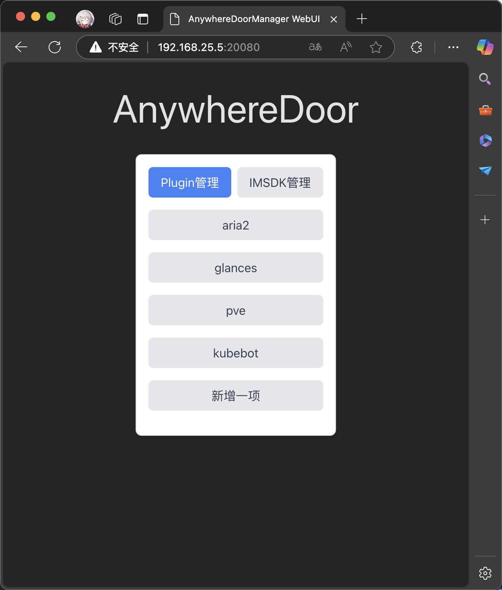
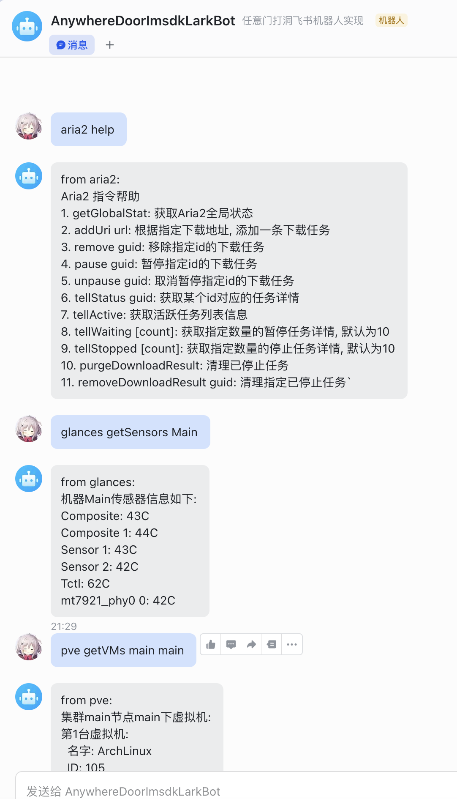
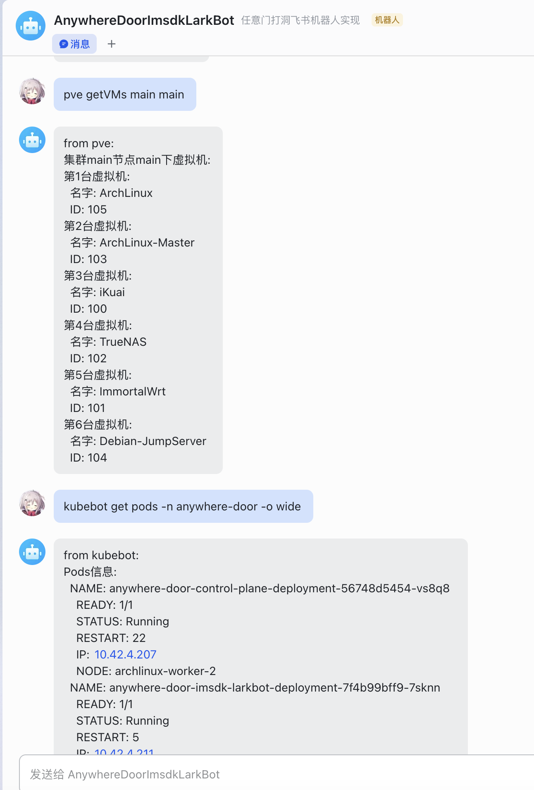
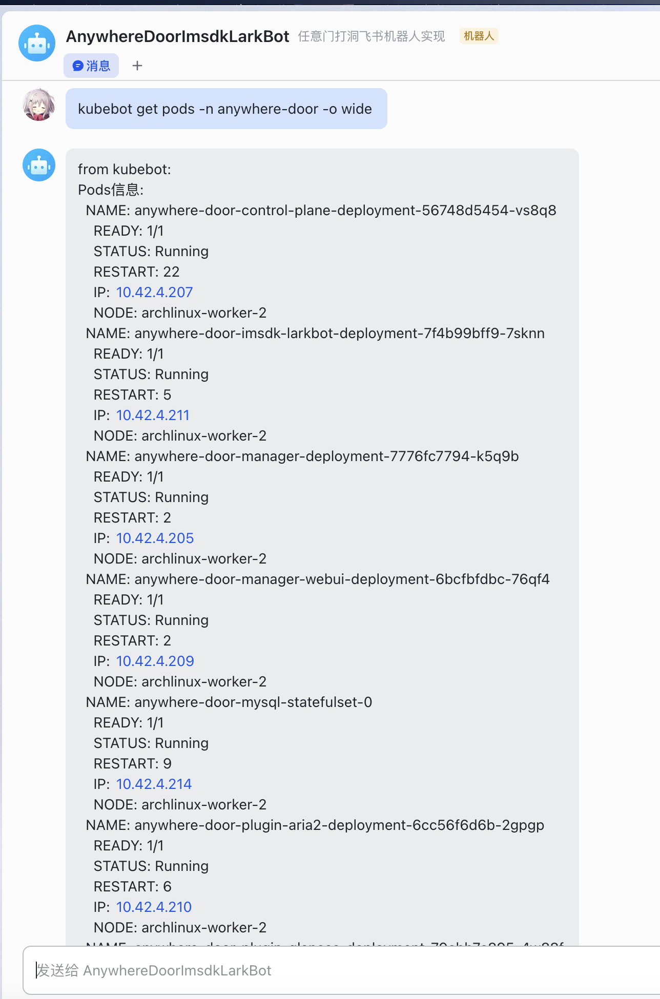

# AnywhereDoor
* 任意门：借助IM软件来实现内网服务打洞
* 项目架构：


## 效果





## 模块地址:
* 项目地址: https://github.com/A0000000000/AnywhereDoor
* 控制平面: https://github.com/A0000000000/AnywhereDoorControlPlane
* 后台管理: https://github.com/A0000000000/AnywhereDoorManager
* 插件集合: https://github.com/A0000000000/AnywhereDoorPlugins
* Imsdk集合: https://github.com/A0000000000/AnywhereDoorImsdks
* 后台管理WebUI: https://github.com/A0000000000/anywhere-door-manager-webui

## 打包环境
1. 安装docker
```shell
# 使用Arch Linux操作系统及yay作为AUR工具
yay -S docker
sudo gpasswd -a $USER docker
sudo systemctl enable --now docker
```

2. 配置docker
```shell
# 创建docker配置文件
cd /etc
sudo mkdir docker
cd docker
sudo touch daemon.json
```
```json
{
    "insecure-registries": ["本地registery地址"],
    "registry-mirrors": [
	    "https://docker.unsee.tech",
	    "https://dockerpull.org",
	    "https://dockerhub.icu"
    ]
}
```

3. 安装buildx
```shell
cd $HOME
mkdir .docker
cd .docker
mkdir cli-plugins
cd cli-plugins
wget https://github.com/docker/buildx/releases/download/v0.18.0/buildx-v0.18.0.linux-amd64
mv buildx-v0.18.0.linux-amd64 docker-buildx
chmod +x docker-buildx
```

4. 验证buildx
```shell
docker buildx version
```

5. 创建并使用构建器环境
```shell
# 创建构建器
docker buildx create --name linux-amd64-builder --driver docker-container --use
# 确保构建器已启动
docker buildx inspect --bootstrap linux-amd64-builder
```


## 部署方法
1. 本文档将指引用户进行基本的部署操作
2. 后续部署都依赖本文档部署的服务

### Docker Command Line
1. 创建一个MySQL环境(可复用现有的数据库)(用户可自行选择是否要挂载数据库文件到宿主): `docker run -itd --name anywhere-door-mysql -p 3306:3306 -e MYSQL_ROOT_PASSWORD=pwd --restart=always 192.168.25.5:31100/mysql:1.0`
2. 创建一个名字叫做`anywhere-door`的数据库: `CREATE DATABASE anywhere_door;`


### Kubernetes
1. 推荐：创建一个命名空间, 专门运行AnywhereDoor相关容器
```yaml
apiVersion: v1
kind: Namespace
metadata:
  name: anywhere-door
  labels:
    name: anywhere-door
```
2. 推荐: 创建一个单独的存储类, 专门用于保存AnywhereDoor相关数据, 笔者使用smb提供存储服务
```yaml
apiVersion: storage.k8s.io/v1
kind: StorageClass
metadata:
  name: smb-anywhere-door
provisioner: smb.csi.k8s.io
parameters:
  source: "smb挂载点"
  csi.storage.k8s.io/provisioner-secret-name: "smbcreds"
  csi.storage.k8s.io/provisioner-secret-namespace: "default"
  csi.storage.k8s.io/node-stage-secret-name: "smbcreds"
  csi.storage.k8s.io/node-stage-secret-namespace: "default"
reclaimPolicy: Delete
volumeBindingMode: Immediate
mountOptions:
  - dir_mode=0777
  - file_mode=0777
  # uid&gid设置为999, 避免MySQL挂载数据启动失败
  - uid=999
  - gid=999
  - nobrl
```
3. 创建MySQL服务, 同Docker, 如果已有, 可以复用, 创建一个数据库: `anywhere_door`, 注意，笔者使用的是本地备份的镜像, 用户自己使用时, 需要自己修改使用的镜像及数据库密码
```yaml
---
apiVersion: v1
kind: ConfigMap
metadata:
  name: mysql-init-scripts
  namespace: anywhere-door
data:
  init.sql: |
    CREATE DATABASE anywhere_door;
---
apiVersion: v1
kind: PersistentVolumeClaim
metadata:
  name: anywhere-door-mysql-pvc
  namespace: anywhere-door
spec:
  accessModes:
    - ReadWriteOnce
  resources:
    requests:
      storage: 128Gi
  storageClassName: "smb-anywhere-door"
---
apiVersion: apps/v1
kind: StatefulSet
metadata:
  name: anywhere-door-mysql-statefulset
  namespace: anywhere-door
spec:
  replicas: 1
  selector:
    matchLabels:
      app: anywhere-door-mysql
  template:
    metadata:
      labels:
        app: anywhere-door-mysql
    spec:
      containers:
      - name: anywhere-door-mysql
        image: 192.168.25.5:31100/mysql:1.0
        imagePullPolicy: IfNotPresent
        env:
        - name: MYSQL_ROOT_PASSWORD
          value: "pwd"
        ports:
        - containerPort: 3306
        volumeMounts:
        - name: anywhere-door-mysql-storage
          mountPath: /var/lib/mysql
        - name: mysql-init-scripts
          mountPath: /docker-entrypoint-initdb.d
      restartPolicy: Always
      volumes:
        - name: anywhere-door-mysql-storage
          persistentVolumeClaim:
            claimName: anywhere-door-mysql-pvc
        - name: mysql-init-scripts
          configMap:
            name: mysql-init-scripts
---
apiVersion: v1
kind: Service
metadata:
  name: anywhere-door-mysql-service
  namespace: anywhere-door
  labels:
    app: anywhere-door-mysql
spec:
  type: ClusterIP
  ports:
  - port: 3306
    targetPort: 3306
  selector:
    app: anywhere-door-mysql
```
4. 用户自己选择是否要将数据库服务暴露在集群外, 控制平面&后台管理不需要数据库服务对外暴露
```yaml
apiVersion: v1
kind: Service
metadata:
  name: anywhere-door-mysql-service-export
  namespace: anywhere-door
  labels:
    app: anywhere-door-mysql
spec:
  type: NodePort
  ports:
  - port: 3306
    targetPort: 3306
    nodePort: 23306
  selector:
    app: anywhere-door-mysql
```
